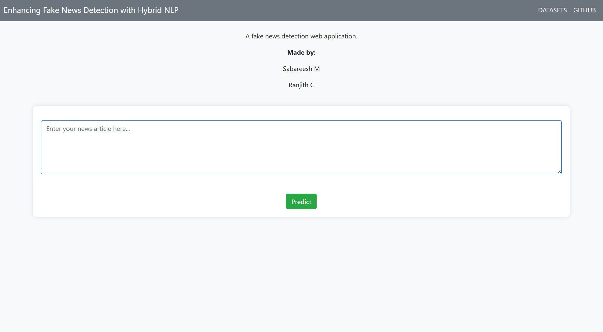
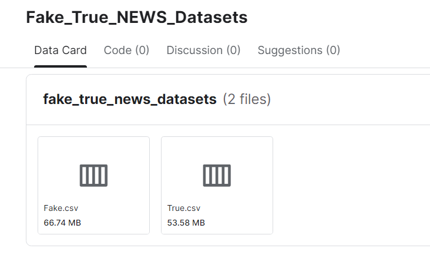

# Fake News Detection Using Hybrid NLP Techniques And ML Algorithms
- mini Project 
- A web application for fake news prediction.

## To Run: [ VSCode + Python 3.10.11 (recommended) ]
- Download this github-repo files and the datasets (true.csv & false.csv)
- Open VSCode and run the "app.py" [ python app.py ]
- Click on the localhost address given by the output-terminal

Datasets used: https://www.kaggle.com/datasets/sabareesh606/fake-true-news-datasets

## Performance Metrics:
- Accuracy - 83.429
- Precision - 82.207
- Recall - 85.060
- F1 Score - 83.609
- ROC AUC Score - 0.834

## Made by:
  1.Sabareesh M
  2.Ranjith C

